Recently I did a session at Georgia State University where I walked students on how to create and deploy a basic website using GitHub Pages to showcase their work, resume, or startup idea. I promised the students that I would do a write up on the steps we went over, how to take it to the next steps, and put it online. So that is what this post is.

## Create a GitHub Account

Head on over to [GitHub](https://github.com) and either sign in or create an account. If you are a student use your .edu email address so you can leverage their student developer pack and get free perks later.
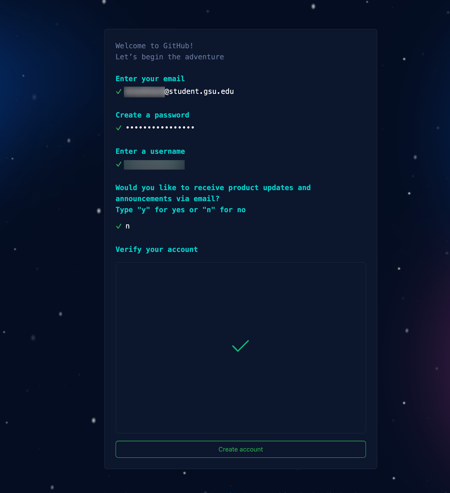

## Create the repo

After you have signed up, head on over to your repos and [create a repo](https://github.com/new) with `username.github.io` as the repo name. For example, mine is `brockneedscoffee.github.io`, ensure it it set to Public, and that you initialize with a README.md file.

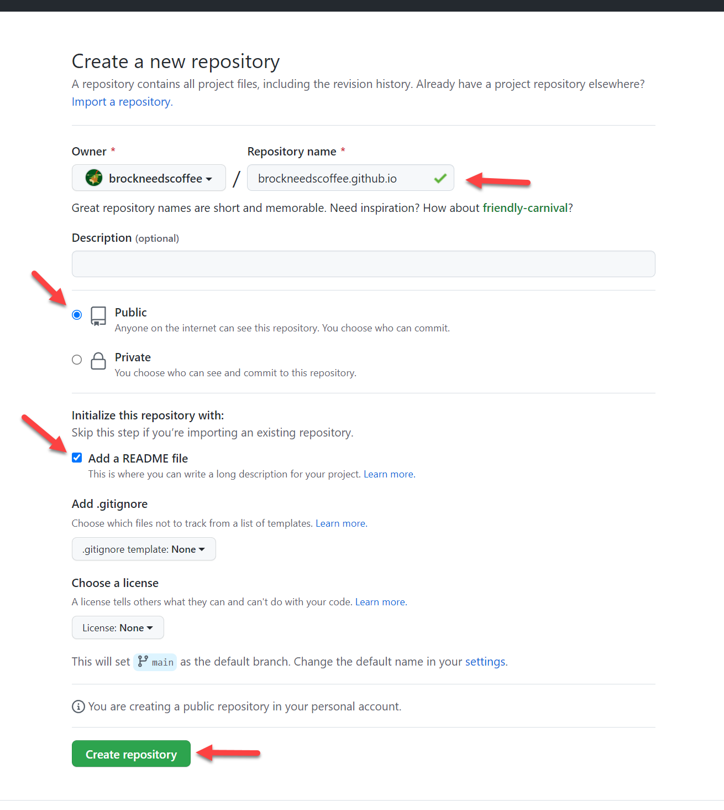

Next, click settings and on the left navigation menu look for pages and click that.  You will see a message that your site is live, click visit site to see your page.

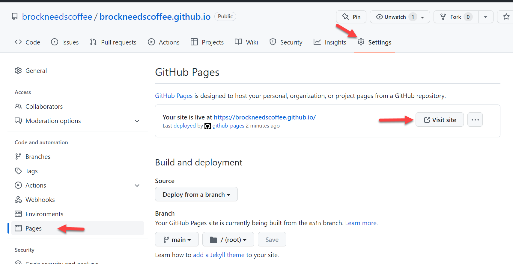

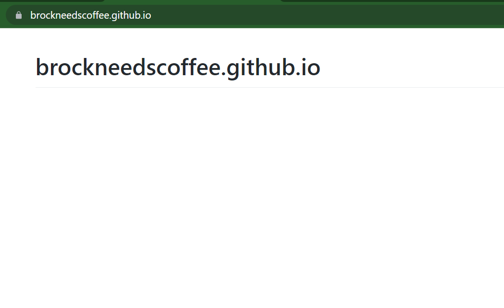

GitHub used what is called GitHub Actions, to take your content and deploy it to the internet.  You can look more into what occured by clicking the Actions tab.

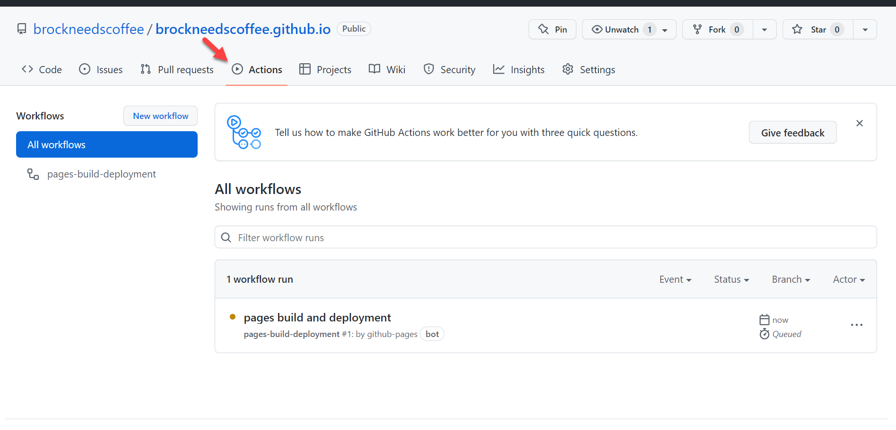

You can look specficially into each step for the action by clicking on the workflow and each step within it.

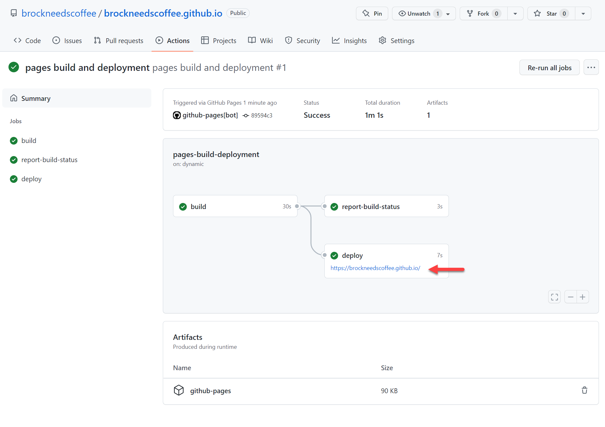

## Edit the page

Now it is time to edit your site.  Click the code tab.  Once there type `.` on your keyboard.  This will open a web editor.

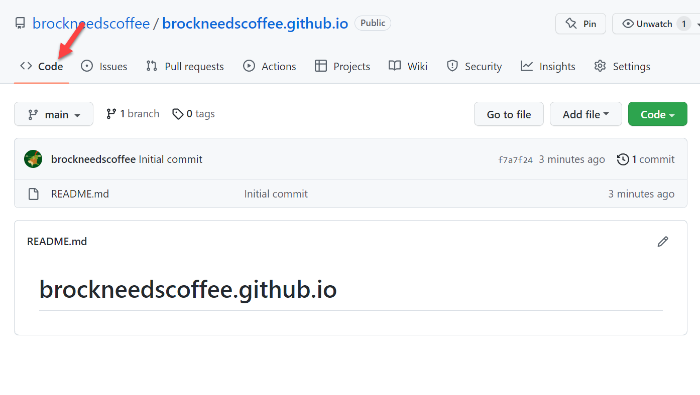

Once you are in the editor, look for the `README.md` file on the left side.  Make whatever changes you want.  For mine I put:

```text
Hi! My name is Brock Davis and I am a Software Development Manager at Amazon Web Services!
```


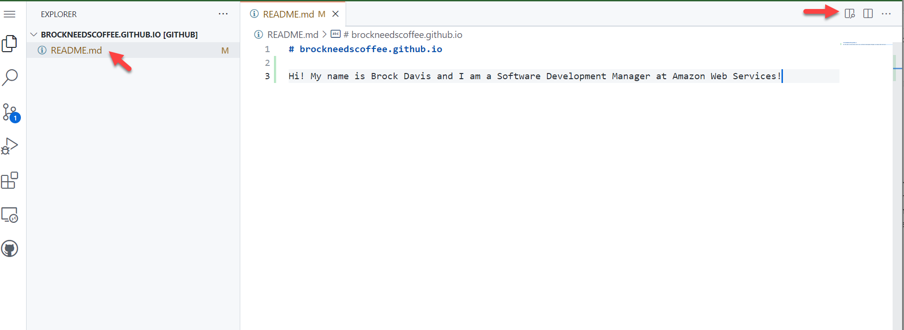

Now you want to commit the change.  Click the branch icon on the left side, you should see a `1` on it.  Then click the plus icon next to the `README.md` file to add your file to the commits

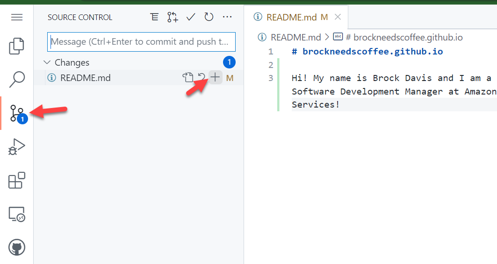

Now input a commit message, I put `initial change` then click the check icon above that to push your changes

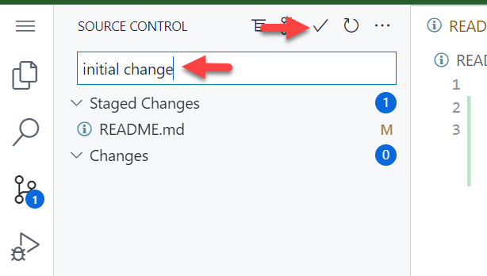

This will trigger another run of the GitHub Action.  Once it is complete, you can visit your site again and you should see the changes

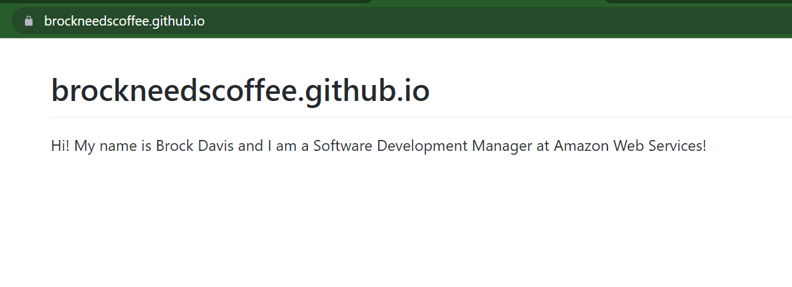

Now let's add some additional details to the `README.md` file and commit those changes like we did above.  It is a markdown file and if you need assistance on the syntax, you can [checkout this cheatsheet](https://www.markdownguide.org/cheat-sheet/).  

I added my resume to the file as seen below

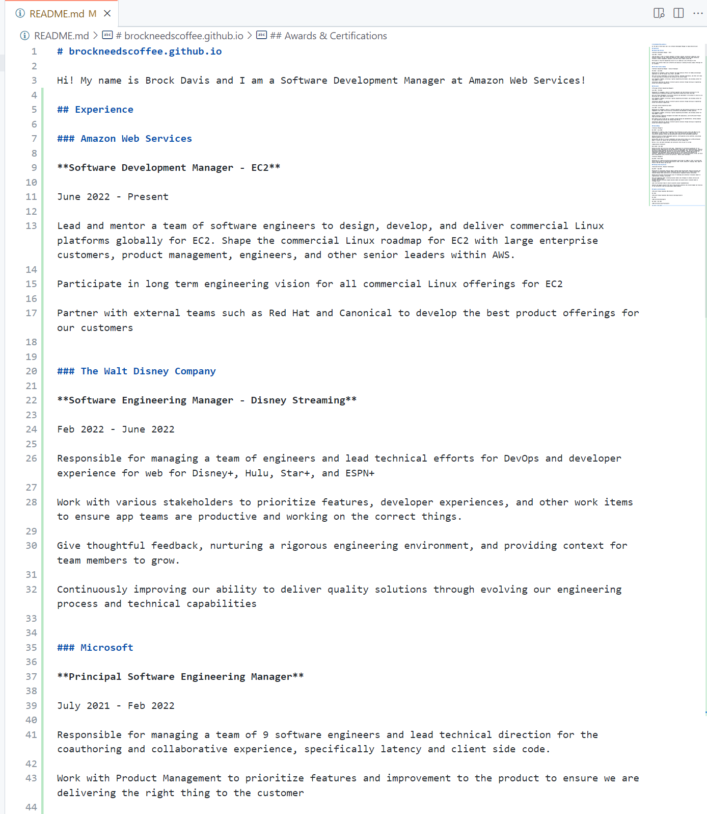

Once I commit my changes and push them, witint a few minutes I should see the changes on my site

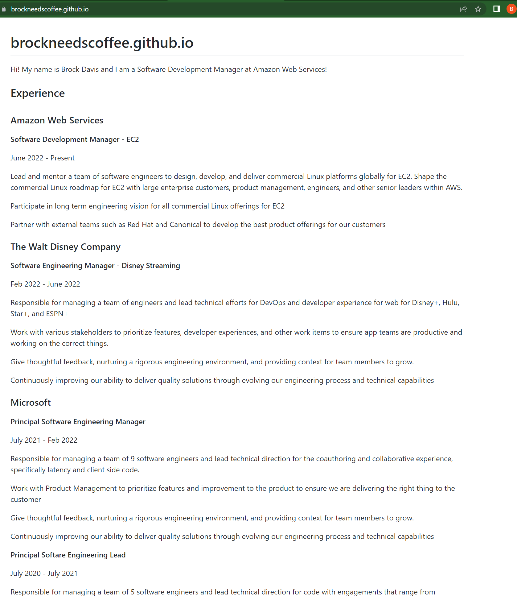

## Take it to the next level

At the end of the day, all the GitHub action is doing is taking the contents of your repo and publishing it.  It is looking for either a `README.md` file or `index.html`.  So next try using things like [Bootstrap](https://getbootstrap.com/docs/5.2/getting-started/introduction/) or some other framework to style and create a custom index.html file to make your site your own.
